# libre_blog_front_end

This the front-end implementation for [libre-blog](https://github.com/fansuregrin/libre-blog).

## Demonstration
login
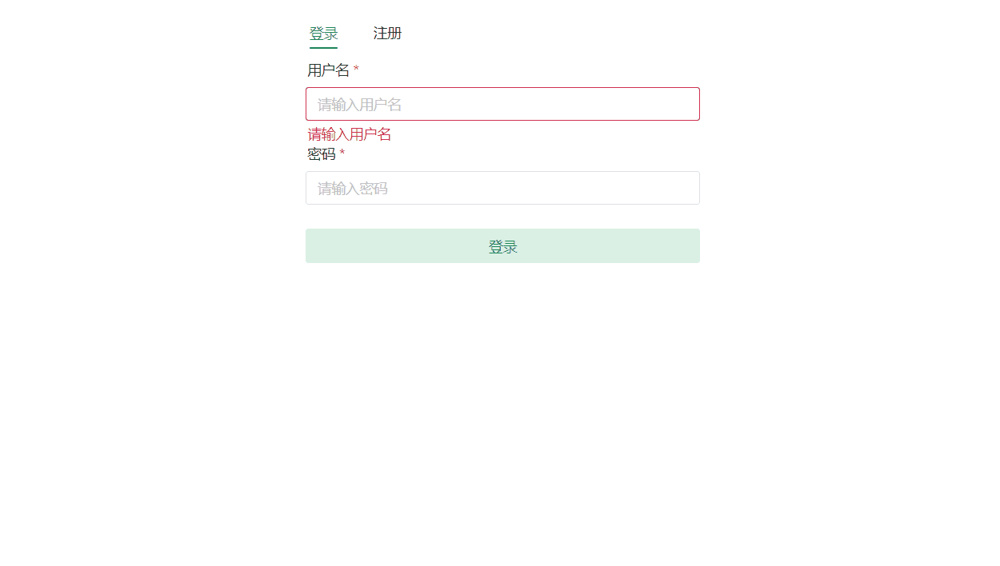

register
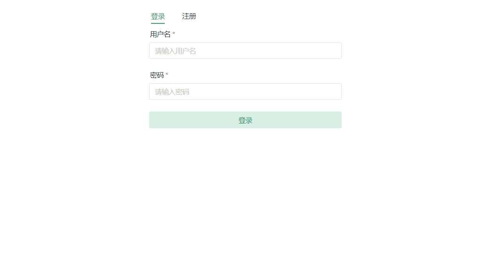

blog-index


code-highlight
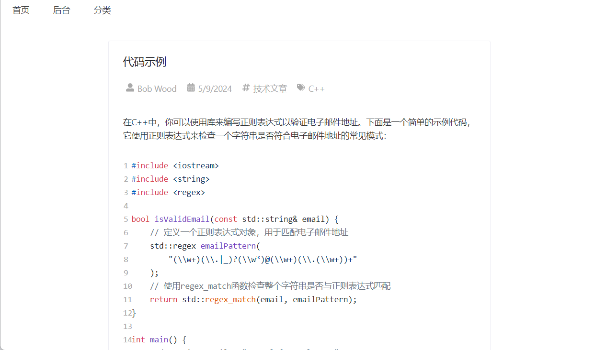

management
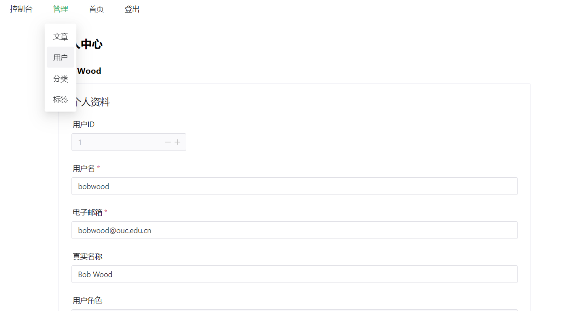

manage user
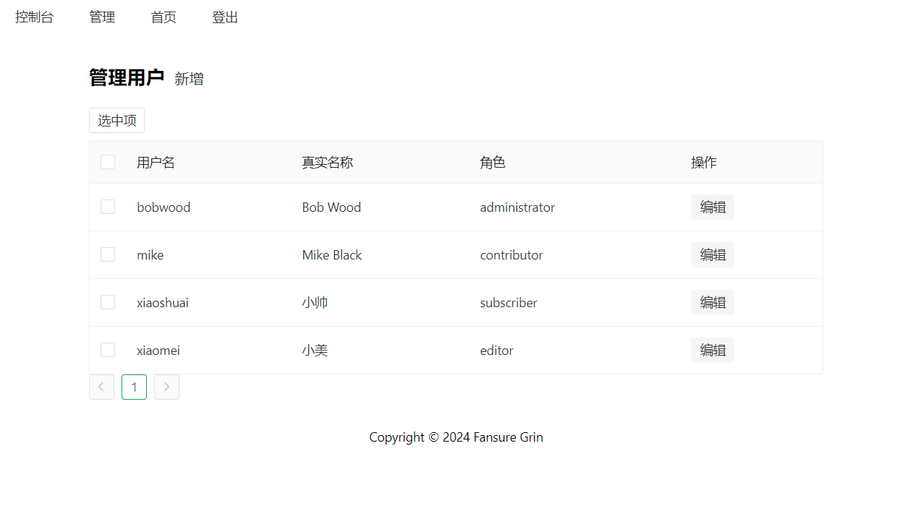

manage category
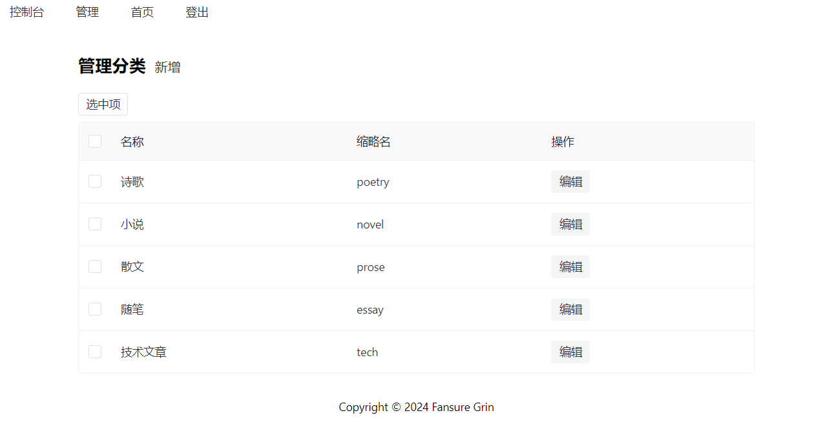

manage tag
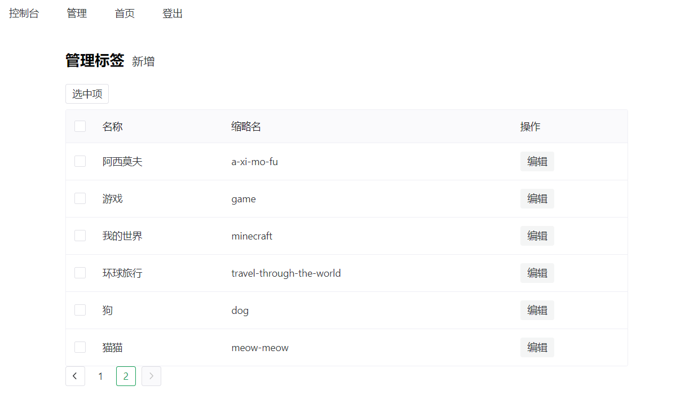

add a new article
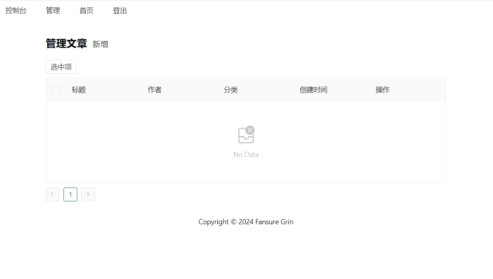

add a new category
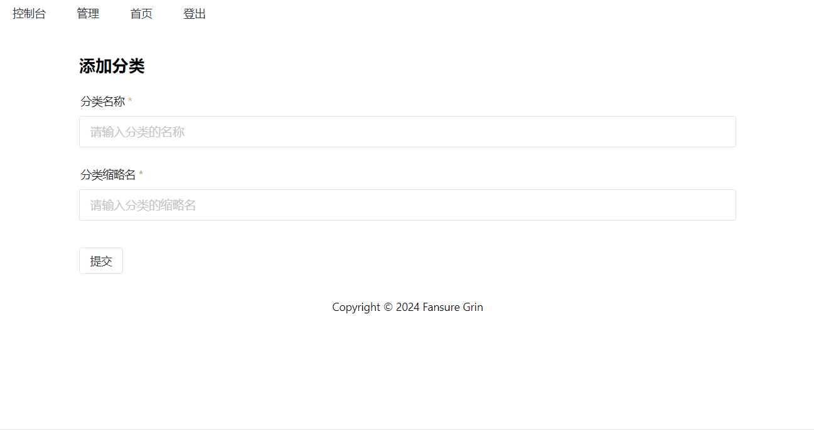

add a new tag
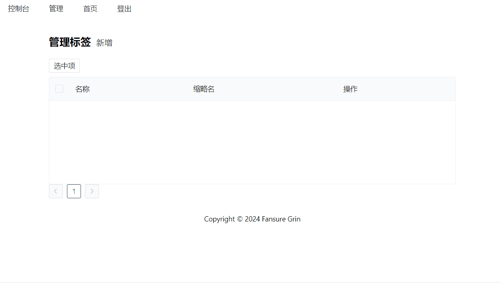

add a new user
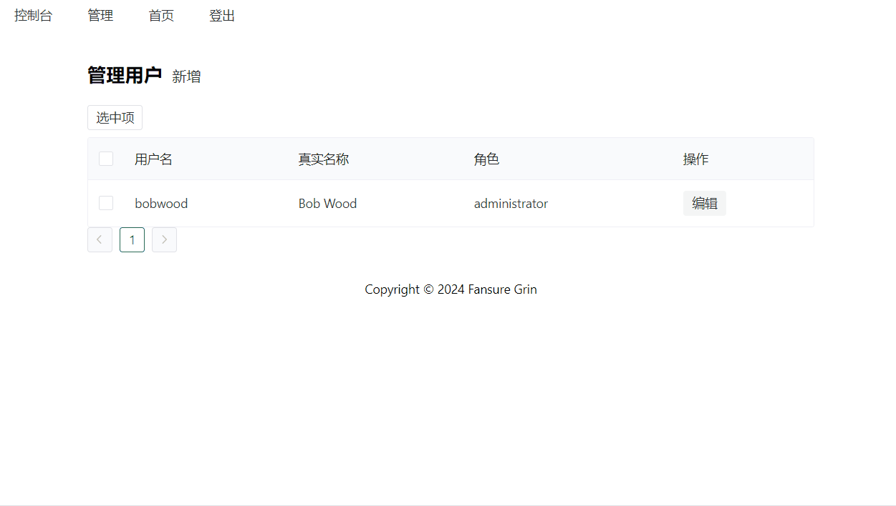

delete categories
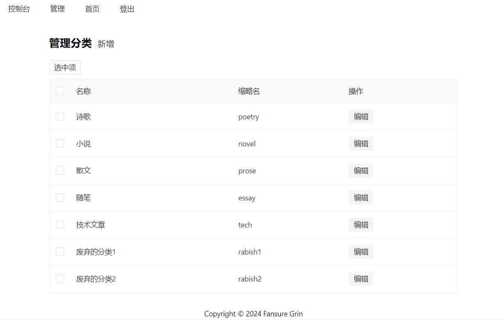

update a category
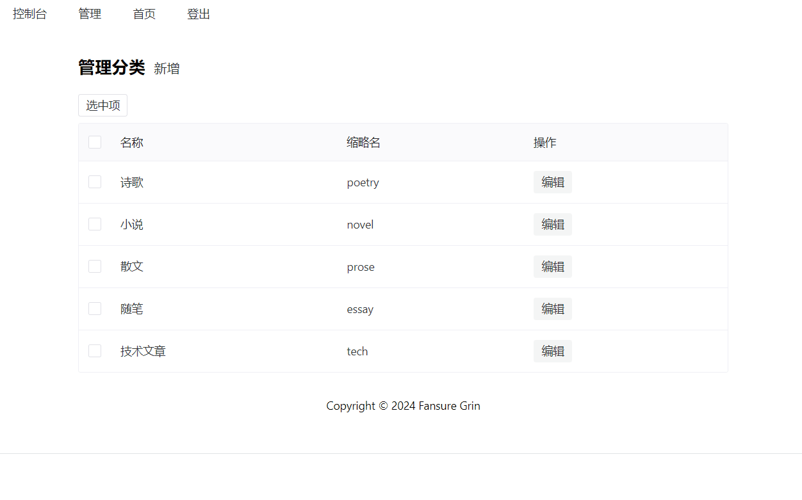

## Recommended IDE Setup

[VSCode](https://code.visualstudio.com/) + [Volar](https://marketplace.visualstudio.com/items?itemName=Vue.volar) (and disable Vetur).

## Customize configuration

See [Vite Configuration Reference](https://vitejs.dev/config/).

## Project Setup

```sh
npm install
```

### Compile and Hot-Reload for Development

```sh
npm run dev
```

### Compile and Minify for Production

```sh
npm run build
```
